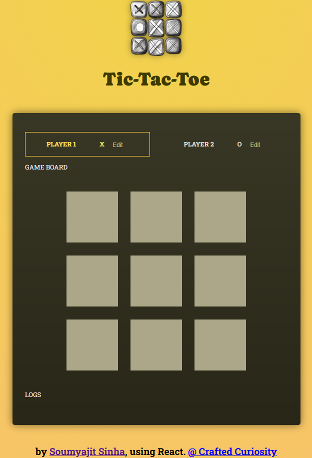

# React Tic Tac Toe

A classic Tic Tac Toe game built with React, demonstrating state management, component-based architecture, and dynamic UI updates.

---

## Features

* **Two-player mode:** Play Tic Tac Toe with another person.
* **Dynamic game board:** Highlights winning combinations.
* **Game history log:** Track moves and game progress.
* **Game over screen:** Shows winner or tie message and allows restarting the game.
* **Reusable components:** Modular design with `GameBoard`, `Player`, `Log`, and `GameOver`.

---

## Screenshots



---

## Installation

1. Clone the repository:

   ```bash
   git clone https://github.com/yourusername/react-tic-tac-toe.git
   cd react-tic-tac-toe
   ```

2. Install dependencies:

   ```bash
   npm install
   ```

3. Run the development server:

   ```bash
   npm run dev
   ```

4. Open your browser at the URL provided by Vite (usually `http://localhost:5173`).

---

## Project Structure

```
src/
│   App.jsx                # Main application
│   index.css              # Global styles
│   index.jsx              # React entry point
│   winning-combinations.js # Predefined Tic Tac Toe winning patterns
│
├───assets
│       react.svg          # Logo or placeholder image
│
└───components
        GameBoard.jsx      # Renders the Tic Tac Toe grid
        GameOver.jsx       # Displays game over message
        Log.jsx            # Shows game history log
        Player.jsx         # Displays player information
```

---

## Technologies

* React 18
* JavaScript (ES6+)
* Vite
* HTML5 & CSS3

---

## Usage

1. Launch the app in the browser.
2. Players take turns clicking on empty squares.
3. When a player wins or the board is full, the game over screen displays the result.
4. Restart the game to play again.

---

## Future Improvements

* Add AI opponent for single-player mode.
* Track player scores across multiple games.
* Add animations for winning combinations.
* Responsive design for mobile devices.

---

## License

This project is open-source and available under the MIT License.
